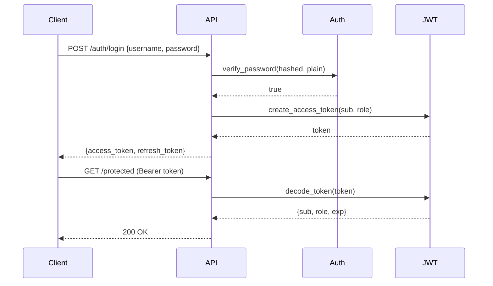
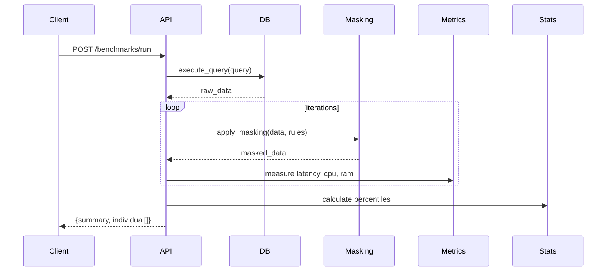
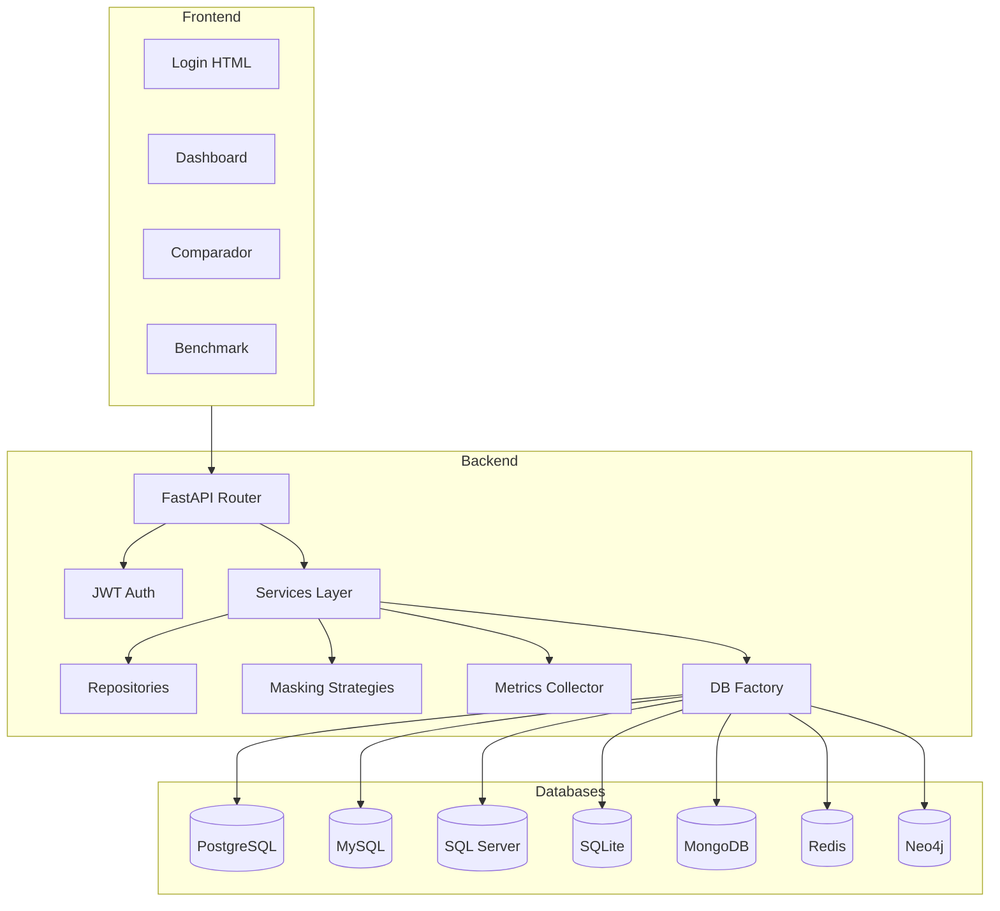

# Multi-DB Masking & Performance Overhead Monitor

Plataforma SecOps / DBA Tools que fusiona un motor de enmascaramiento dinámico de datos con un monitor de rendimiento e infraestructura.

## Arquitectura

```
backend/
├── app/
│   ├── api/v1/endpoints/    # FastAPI endpoints
│   ├── auth/                 # JWT authentication & authorization
│   ├── core/                 # Config, security, logging, middleware
│   ├── database/             # Factory + 7 DB engines
│   │   └── engines/          # PostgreSQL, MySQL, SQLServer, SQLite, MongoDB, Redis, Neo4j
│   ├── masking/              # Strategy Pattern + 4 algorithms
│   ├── metrics/              # Collector + Benchmark engine
│   ├── models/               # SQLAlchemy ORM models
│   ├── repositories/         # Data access layer
│   ├── schemas/              # Pydantic v2 schemas
│   └── services/             # Business logic
├── tests/
│   ├── unit/                 # Unit tests (pytest)
│   └── integration/          # Integration tests (TestClient)
└── scripts/                  # Seed data, utilities
frontend/
├── *.html                    # Pages (login, dashboard, compare, benchmark, reports)
├── js/                       # Vanilla JS modules
└── css/                      # Styles
docs/                         # Documentation
docker/                       # Dockerfiles + nginx
.github/workflows/            # CI/CD
```

## Stack Tecnológico

| Componente | Tecnología |
|------------|-----------|
| Backend | Python 3.11+, FastAPI, Pydantic v2 |
| ORM | SQLAlchemy 2.0 |
| Auth | JWT (python-jose), bcrypt |
| DB Engines | PostgreSQL, MySQL, SQL Server, SQLite, MongoDB, Redis, Neo4j |
| Masking | Redacción, SHA-256, AES/Fernet, FPE |
| Frontend | HTML5, TailwindCSS, Chart.js, Vanilla JS |
| Testing | pytest, pytest-cov, httpx |
| Quality | Ruff, Black, Mypy, Bandit |
| Docker | Multi-stage, nginx reverse proxy |
| CI/CD | GitHub Actions |

## Instalación

### Requisitos
- Python 3.11+
- pip

### Setup

```bash
# Clonar repositorio
git clone https://github.com/tu-usuario/masking-monitor.git
cd masking-monitor/backend

# Crear entorno virtual
python -m venv venv
source venv/bin/activate  # Linux/Mac
# venv\Scripts\activate   # Windows

# Instalar dependencias
pip install -r requirements.txt

# Configurar variables de entorno
cp .env.example .env
# Editar .env con tus credenciales

# Ejecutar seed (datos iniciales)
python scripts/seed_data.py

# Iniciar servidor
python run.py
# o
uvicorn app.main:app --reload --port 8000
```

### Acceso
- **API Docs**: http://localhost:8000/docs
- **ReDoc**: http://localhost:8000/redoc
- **Frontend**: http://localhost:8000/static/login.html
- **Health**: http://localhost:8000/health

### Usuarios por defecto
| Usuario | Contraseña | Rol |
|---------|-----------|-----|
| admin | Admin123! | admin |
| analyst | Analyst123! | analyst |
| viewer | Viewer123! | viewer |

## Ejecución

```bash
# Desarrollo
uvicorn app.main:app --reload --port 8000

# Producción
uvicorn app.main:app --host 0.0.0.0 --port 8000 --workers 4

# Docker
docker-compose -f docker-compose.dev.yml up --build
```

## Testing

```bash
cd backend

# Todos los tests
pytest tests/ -v

# Solo unit tests
pytest tests/unit/ -v

# Con cobertura
pytest tests/ -v --cov=app --cov-report=term-missing

# Con cobertura mínima (falla si < 70%)
pytest tests/ -v --cov=app --cov-fail-under=70
```

## CI/CD

Pipeline GitHub Actions:

1. **Lint**: Ruff, Black, Mypy, Bandit
2. **Test**: pytest con cobertura
3. **Build**: Docker images

```yaml
# .github/workflows/ci.yml
on: [push, pull_request]
jobs:
  lint → test → build
```

## Endpoints Principales

### Auth
- `POST /api/v1/auth/login` - Iniciar sesión
- `POST /api/v1/auth/refresh` - Renovar token
- `POST /api/v1/auth/logout` - Cerrar sesión
- `GET /api/v1/auth/me` - Usuario actual

### Masking
- `GET /api/v1/masking/algorithms` - Listar algoritmos
- `POST /api/v1/masking/apply` - Aplicar enmascaramiento

### Métricas
- `GET /api/v1/metrics/live` - CPU, RAM en tiempo real
- `GET /api/v1/metrics/history` - Historial de métricas
- `GET /api/v1/metrics/export?format=csv` - Exportar CSV/JSON

### Benchmark
- `POST /api/v1/benchmarks/run` - Ejecutar benchmark
- `GET /api/v1/benchmarks/history` - Historial de benchmarks

### Dashboard
- `GET /api/v1/dashboard/stats` - Estadísticas KPI

## Diagramas de Arquitectura

### Flujo de Autenticación


### Flujo de Benchmark


### Componentes


## Despliegue Gratuito

### Backend (Render Free)
1. Conectar repo de GitHub
2. Seleccionar `backend/` como root directory
3. Build command: `pip install -r requirements.txt`
4. Start command: `uvicorn app.main:app --host 0.0.0.0 --port $PORT`

### Frontend (Cloudflare Pages)
1. Conectar repo de GitHub
2. Output directory: `frontend/`
3. Sin build command (HTML estático)

### Base de Datos (Supabase Free)
1. Crear proyecto en Supabase
2. Copiar DATABASE_URL
3. Configurar en variables de entorno del backend

## Licencia

MIT
